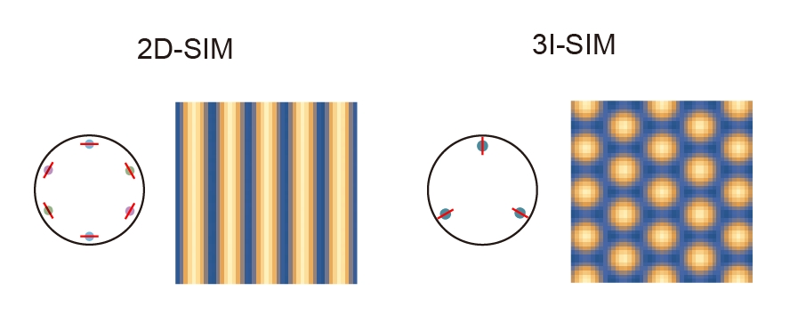
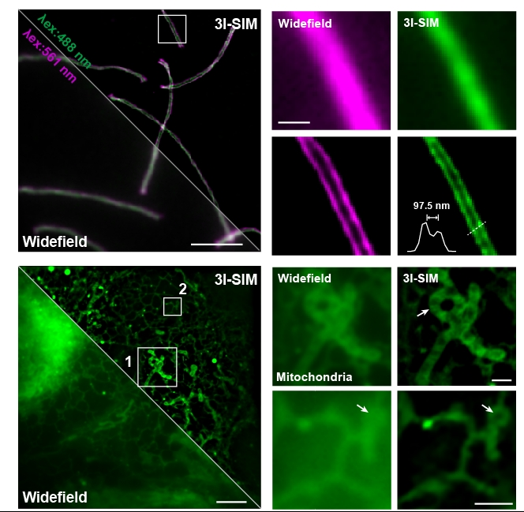

# Analytical and deep-learning assisted reconstruction code for 3I-SIM

This is the supplementary software and source code for our manuscript "Triangle beam interference structured illumination microscopy", which is accepted by Nature Photonics 🎉🎉🎉.

This work introduces a new type of structured illumination microscopy that uses radially polarized three-beam interference. The illumination patterns are shown below:

Currently, the package contains the .m source code and a .exe files containing GUI of the 3I-SIM reconstruction code, and .py files for deep learning 3I-SIM reconstruction.

## 💻 System requirements

The analytical reconstruction software is implemented with MATALB 2020b and tested in Windows 10&11 environments.

The deep learning reconstruction code is developed based on Python/Pytorch.

## 💿️ Installation guide

The analytical reconstruction package does not need additional installation steps. 

To run the conventional reconstruction algorithm with the .m file, it is only required to install MATLAB at any version (this code is written based on MATLAB 2020b, different MATLAB version may have different function rules that influence the functioning).

To run the .exe files, the MATLAB software is not necessary but one should download and install the 15 MATLAB runtime version 2020b for compiling from: https://ww2.mathworks.cn/products/compiler/matlab-runtime.html.

For the deep learning source code, we recommend using Anaconda to build a virtual environment and install the packages in the requirement.txt file to run the 3I-SIM reconstruction code.

## 🌐 Datasets

The example 3I-SIM imaging data are available at the figshare repository: https://figshare.com/articles/dataset/3I-SIM_dataset/26334118

The deep learning training, validation and testing datasets are available at the Zenodo repository: https://zenodo.org/records/14969641

## ✨ Instruction

A detailed UserManual is attached with the project for demonstration. 

Some example reconstruction results:

## 🎯 Running time
It usually takes 5 to 20 seconds to reconstruct a 1024x1024 super-resoltuion image from a 512x512x7 image stack, depending on the CPU performance. 

